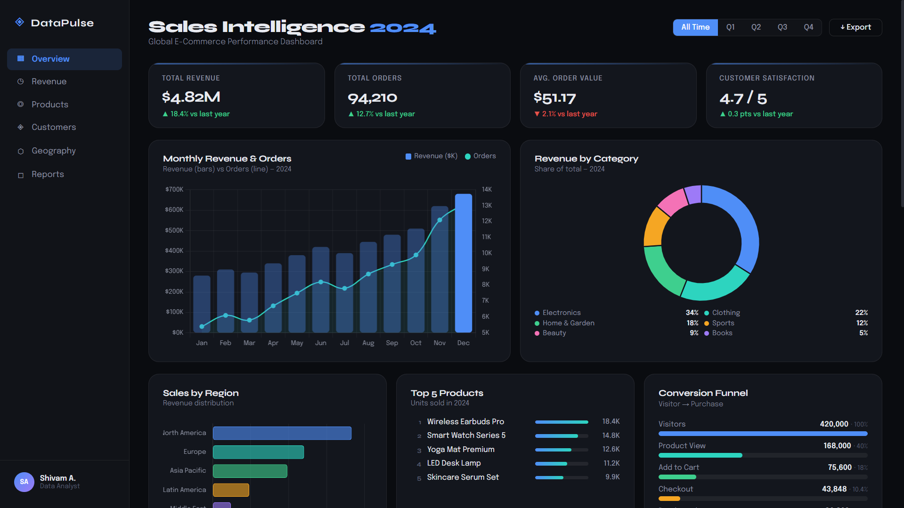

# **🚀 DataPulse — Global E-Commerce Analytics Dashboard**

A dark-themed, responsive analytics dashboard built with pure HTML, CSS, and Vanilla JavaScript for modern e-commerce storyboarding.


## Live Demo

- Placeholder: [https://github.com/shivamssingh07](https://github.com/shivamssingh07)
- To publish on GitHub Pages:
  1. Push this repository to GitHub.
  2. Enable GitHub Pages in repository settings and select the `main` branch or `docs/` folder.

## Project Overview

DataPulse delivers a polished e-commerce BI experience without any build tools. Open `index.html` directly to view a fully responsive dashboard powered by Chart.js and custom CSS animations.

## Features Snapshot

| Visualization | Chart Type | Insight Revealed |
|---|---|---|
| Monthly Revenue & Orders | Combo Bar + Line | Quarterly revenue & order trends with interactive filter support |
| Revenue Breakdown | Donut Chart | Category share across 6 product segments |
| Regional Performance | Horizontal Bar | Sales distribution across 6 global markets |
| Product Rankings | Animated List | Top 5 bestselling products with animated bars |
| Conversion Funnel | Custom HTML Funnel | Visitor-to-purchase drop-off across 5 stages |
| Customer Acquisition | Stacked Area | New vs returning customer growth trends |
| Order Heatmap | CSS Grid Heatmap | Hourly and daily order intensity across the week |
| Price vs Rating | Scatter Chart | Product pricing and satisfaction distribution |
| Channel Performance | Table + Mini Bars | Revenue, order volume, and conversion efficiency per channel |

## Tech Stack

- 🌐 HTML5 semantic dashboard layout
- 🎨 CSS3 custom properties, Grid, Flexbox, and dark theme tokens
- ⚡ Vanilla JavaScript (ES6+) DOM + filter logic
- 📊 Chart.js 4.4 for polished visualizations
- 🔤 Google Fonts: `Syne` + `Epilogue`

## Project Structure

```text
Global E-Commerce Sales Analytics/
├── index.html         # Semantic dashboard layout with sidebar and charts
├── style.css          # Design system, responsive layout, animations, dark theme
├── app.js             # Data, Chart.js config, filters, DOM behaviors
└── README.md          # Project overview and usage guide
```

## Getting Started

1. Clone this repository.
2. Open `index.html` in your browser.

## How to Connect Real Data

`app.js` currently uses a local `DATA` object for simulated 2024 e-commerce metrics. To connect real data:

1. Replace the static `DATA` object with a `fetch()` call.
2. Ensure the fetched JSON matches this shape:

```js
const DATA = {
  revenue: [/* 12 monthly values */],
  orders: [/* 12 monthly values */],
  newCustomers: [/* 12 monthly values */],
  returningCustomers: [/* 12 monthly values */],
};
```

3. Example replacement:

```js
fetch('/data/dashboard-data.json')
  .then(res => res.json())
  .then(json => {
    Object.assign(DATA, json);
    init();
  })
  .catch(err => console.error('Failed to load dashboard data', err));
```

> Tip: Keep `DATA` arrays aligned by month so `MONTHS` mapping and quarterly filters work correctly.

## Fake Dataset Used

- 12 months of simulated 2024 e-commerce data
- $4.82M total revenue
- 94,210 orders
- $51.17 average order value (AOV)
- 4.7 / 5 customer satisfaction (CSAT)
- 6 regions, 5 product categories, 5 acquisition channels

## Skills Demonstrated

- Data visualization and dashboard storytelling
- Responsive UI design for desktop and mobile
- Chart.js mastery with custom global defaults and multi-axis combo charts
- Vanilla JavaScript state management, DOM creation, and filter logic
- Accessibility-first canvas ARIA labels, fallback text, and semantic layout
- Design system implementation using CSS variables and motion

## Screenshots




## Why this project?

DataPulse was designed to show what a modern analytics dashboard can look like without relying on frameworks or build tools. It solves the everyday challenge of communicating e-commerce performance clearly, with a polished visual story for stakeholders.

## Contributing

Contributions are welcome! If you want to add a new visualization, improve accessibility, or swap the static dataset for a real API integration, feel free to open an issue or pull request.

## License

MIT License © 2026

## Author

- LinkedIn: (linkedin.com/in/shivam-singh-80135a281)
- GitHub: (https://github.com/shivamssingh07)
